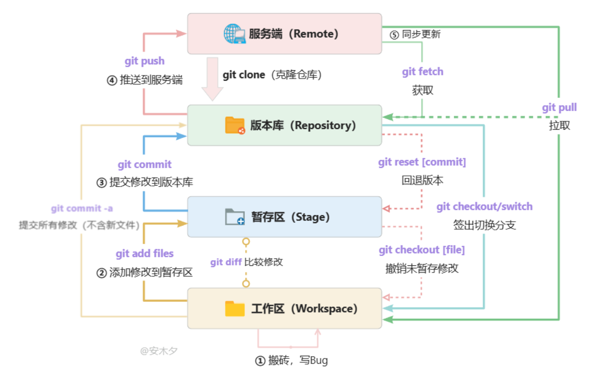

### 


### 创建新的仓库并推送远程
```
git init
git add xxx
git commit xxx
git branch -M main
git remote add origin /url
git push -u origin main
```

### 实用git命令
#### git diff
```
#查看某个文件的工作区与暂存区的差异
$ git diff file.txt
#查看暂存区与仓库区的差异
$ git diff --cached file.txt
#*查看某个文件 工作区与上一次commit之间的差异
$ git diff HEAD file.txt
#查看两个commit的差异
$ git diff <commit1> <commit2>
#查看两个commit中某个文件的差异
$ git diff <commit1> <commit2> -- filename
#*生成patch
$ git diff xxx > file.patch
#查看patch文件
$ vim file.patch
#*检查patch是否可用
$ git apply --check file.patch
#*合入patch
$ git apply file.patch
#patch冲突
$ git apply --reject
```


### 使用心得
pull 时 （工作区有未暂存的修改）或（暂存区有未提交的修改） 时，
git终止并提示会覆写(前提是和远端修改的是同一个文件，如果不是一个文件则无影响 )   需要commit或者stash

可以先stash一下 再pull ，这样同一个文件不同位置没事   但是同一个文件同一个位置stash pop后就需要手动处理冲突了


### 项目push只允许有一个commit   
方法：     
1.1无分支情况下 stash
```
$git stash
$git pull //或者 git fetch git merge
$git stash pop
//解决冲突
$git commit

$git commit --amend
```
1.2 无分支的情况下 rebase
```
todo
```

2.有新建分支的情况下
```
$git stash   //in feature branch
$git checkout master
$git pull 
$git checkout feature
$git merge master   //in feature branch 
$git stash pop      //may be confict
//解决冲突
$git commit 
//再次提交
$git commit --amend  //确保只有一个commit
$git checkout master
$git merge feature
$git push

//删除分支
$git branch -D xxx
```

变基：
如果你只对不会离开你电脑的提交执行变基，那就不会有事。 如果你对已经推送过的提交执行变基，但别人没有基于它的提交，那么也不会有事。 如果你对已经推送至共用仓库的提交上执行变基命令，并因此丢失了一些别人的开发所基于的提交， 那你就有大麻烦了，你的同事也会因此鄙视你。

### 工具
gerrit
repo

### 资料
[阮一峰 Git 教程](https://www.bookstack.cn/read/git-tutorial/docs-basic.md)
[git 图文教程](https://www.cnblogs.com/anding/p/16987769.html)